# Hercules Android App

## Features
Hercules is a realtime supplements ordering android application. The application is hosted in Firebase and implements the Material design guidlines. 
The User app provides the following functionalities :

* Place Orders
* View Orders and Status in Realtime
* View SOL and Ledger documents
* Request SOL and Ledger Documents

## Screenshots

| 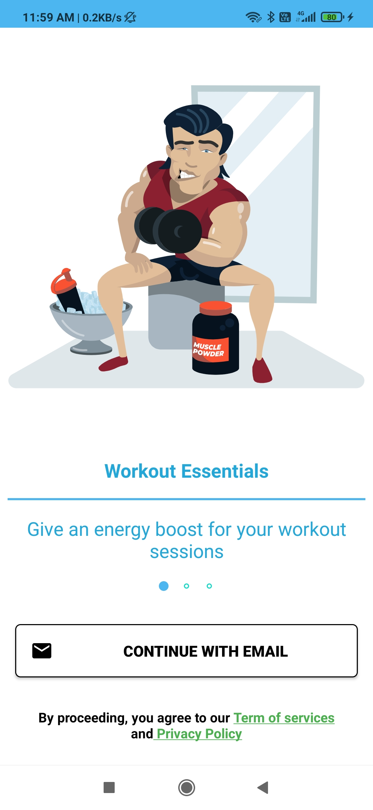 | 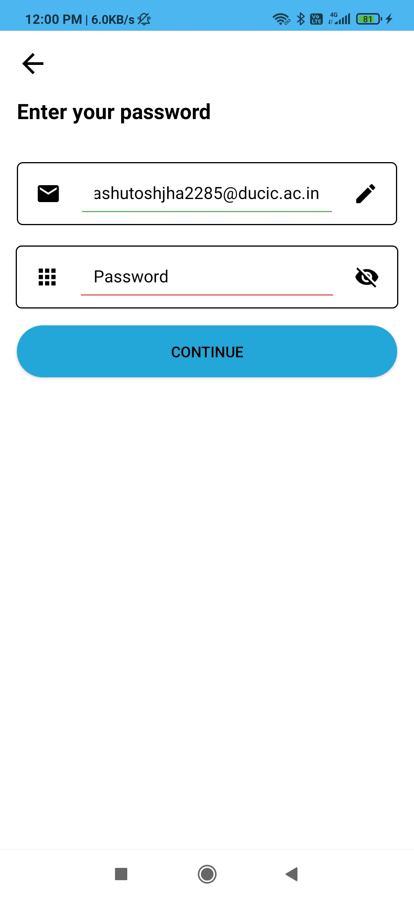 | 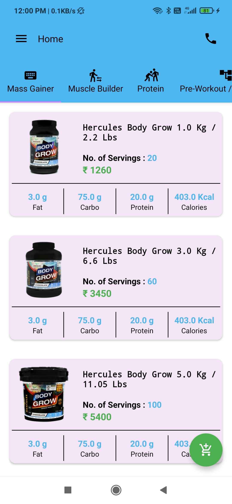 | 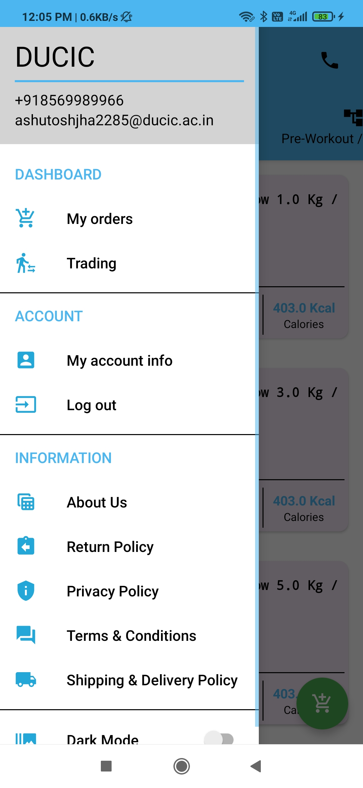 |
| --------------------------------------- | ---------------------------------------- | ---------------------------------------- | ---------------------------------------- |
| Intro                                    | Login                       | Home Screen                       | Navigation View                             |

| 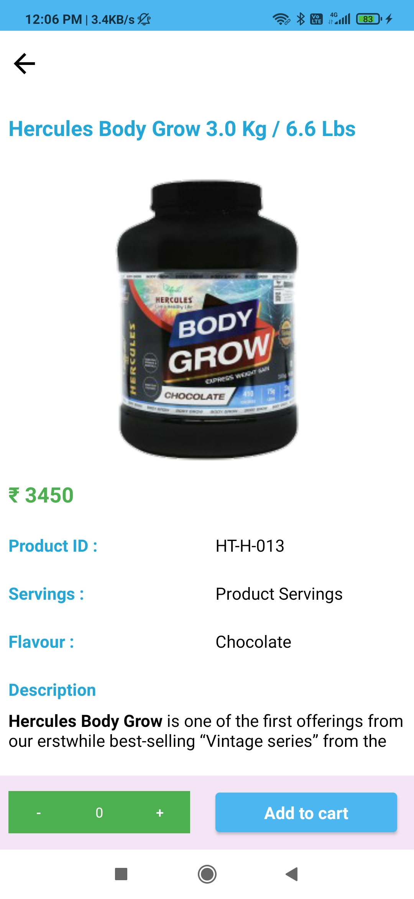 | 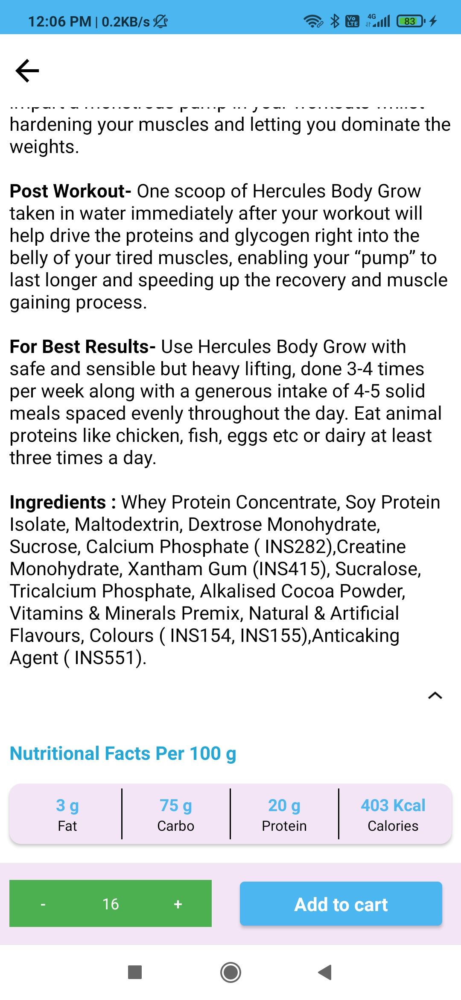 | 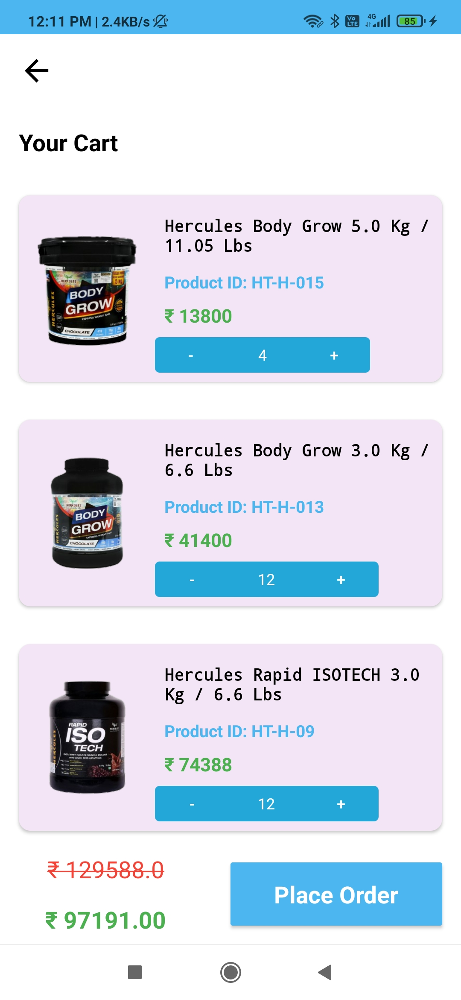 | 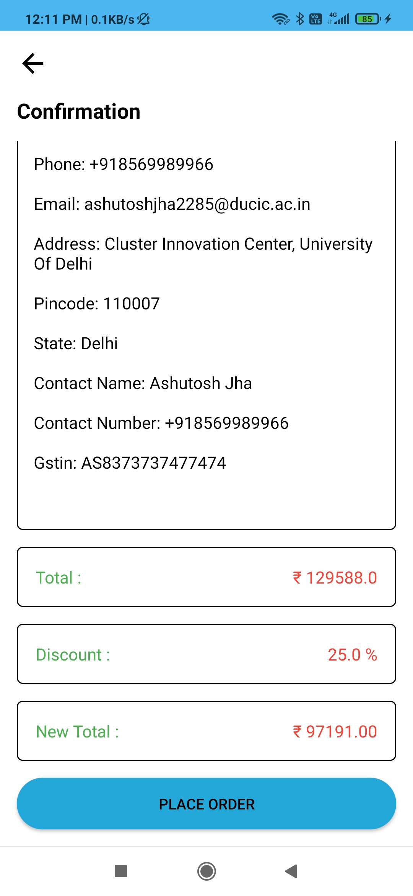 |
| ---------------------------------------- | ---------------------------------------- | ---------------------------------------- | ---------------------------------------- |
| Product                             | Product Description                      | Cart                | Place Order                      |

| 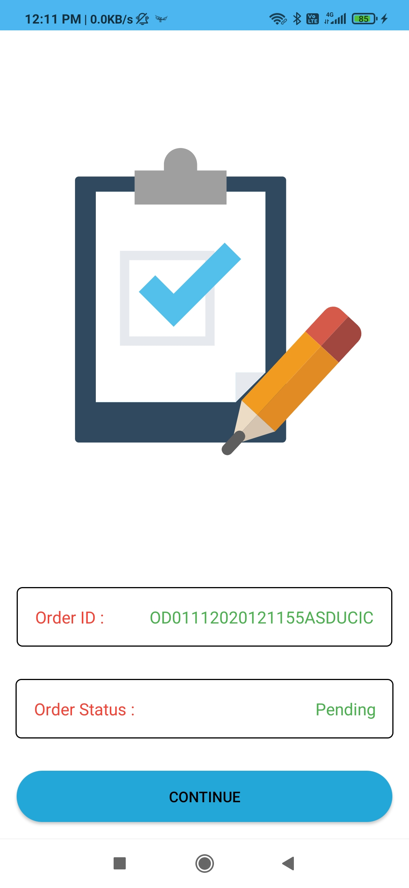 | 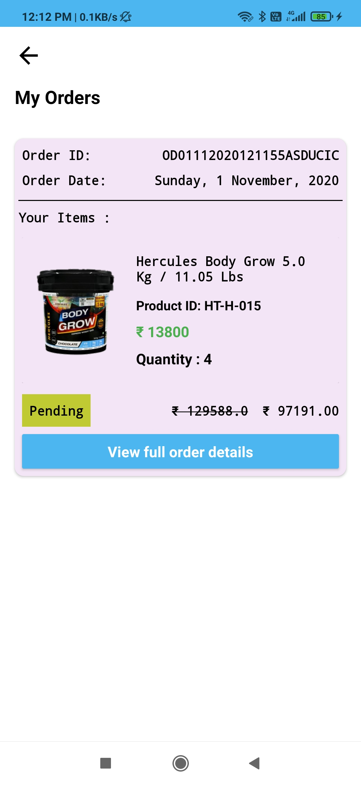 | 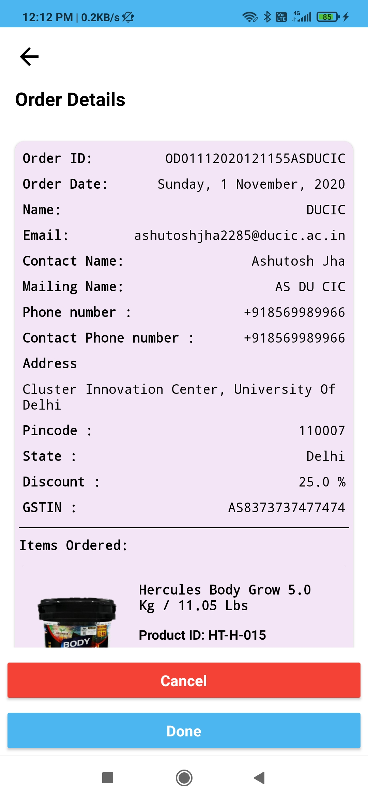 | 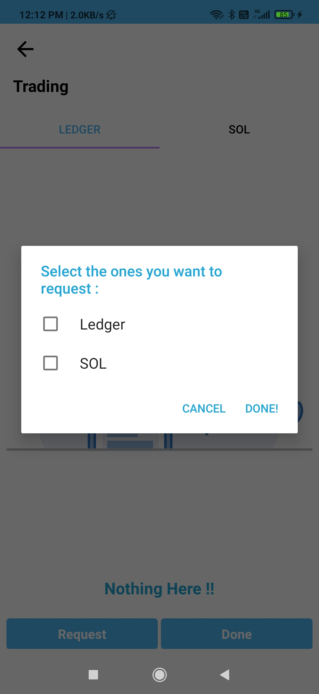 |
| ---------------------------------------- | ---------------------------------------- | ---------------------------------------- | ---------------------------------------- |
| Order Confirmation                             | Orders History                      | Detailed Order History                |  Request SOL / Ledger                     |

| 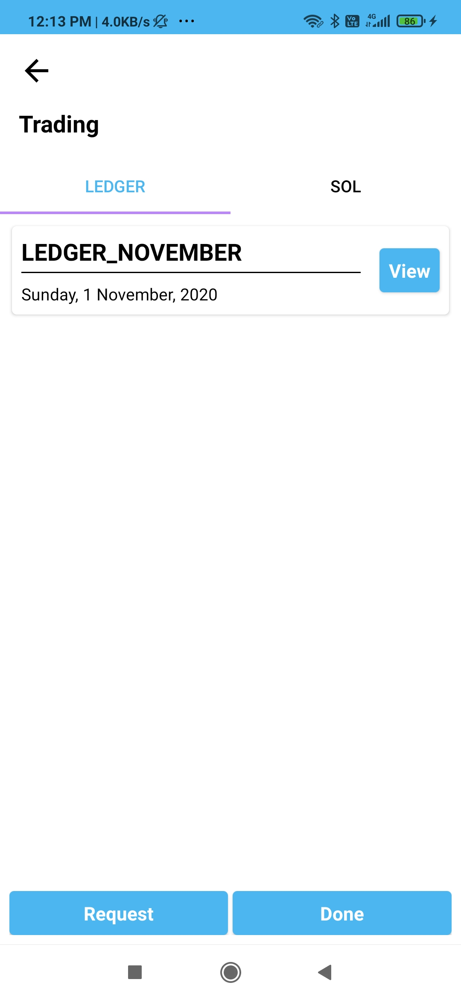 | 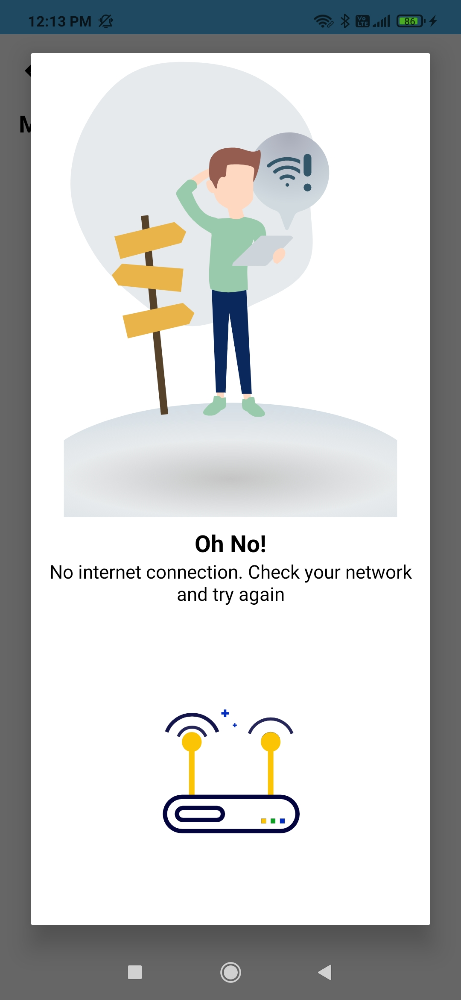 | 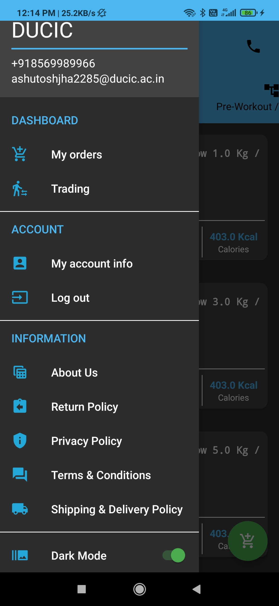 | 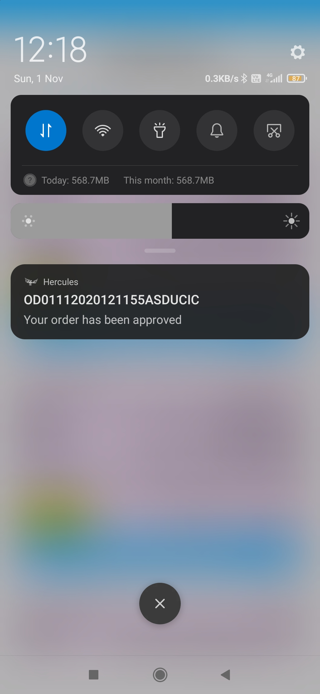 |
| ---------------------------------------- | ---------------------------------------- | ---------------------------------------- | ---------------------------------------- |
|  View SOL / Ledger                          | No Internet Dialog                      | Dark Mode               | Notifications                    |

## How to Set Up ?

* First you need to clone the [Business app for Hercules](https://github.com/pycrash/HerculesBusiness)
* Create a new Firebase Project and add both business and user app..
* Make sure to enable Firestore, Realtime database and Firebase Storage.
* Add a collection named Admin in Firestore in which make a document whose ID is your email. The document fields should be as - name : (your name), email : (your email), password : (your password) as shown in below pic.

* Login and add Customer under Customers tab.
* Login in the user app and enjoy.

## License

Hercules is licensed under [Creative Commons Zero v1.0 Universal](https://github.com/pycrash/Hercules/blob/master/LICENSE)
